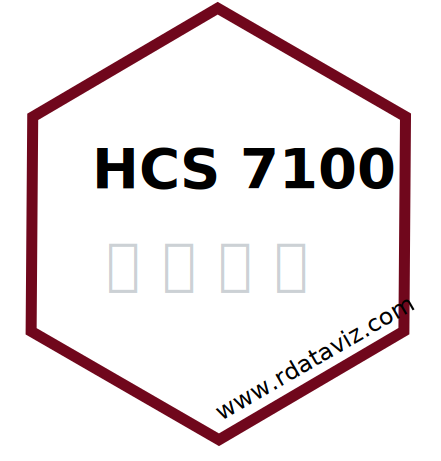

# Source repository for course website for Ohio State University's HCS 7100

|                                                                                                                                                                                                                                                                                   |                                                                                                                                                         |
|-----------------------------------------------|-------------------------|
| This is the repository for the source code for Ohio State University's Horticulture and Crop Science (HCS) 7100: Data Visualization in R, offered each Autumn by [Jessica Cooperstone](www.cooperstonelab.com). The website can be found at [www.rdataviz.com](www.rdataviz.com). |  |
