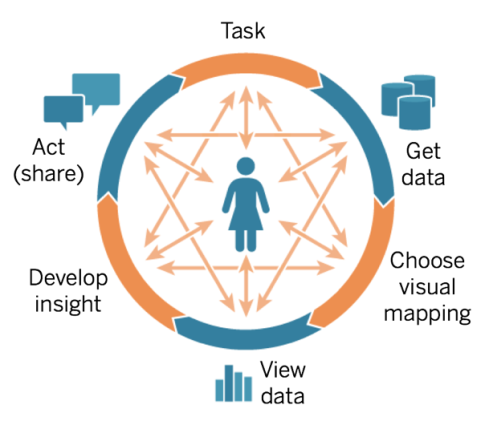
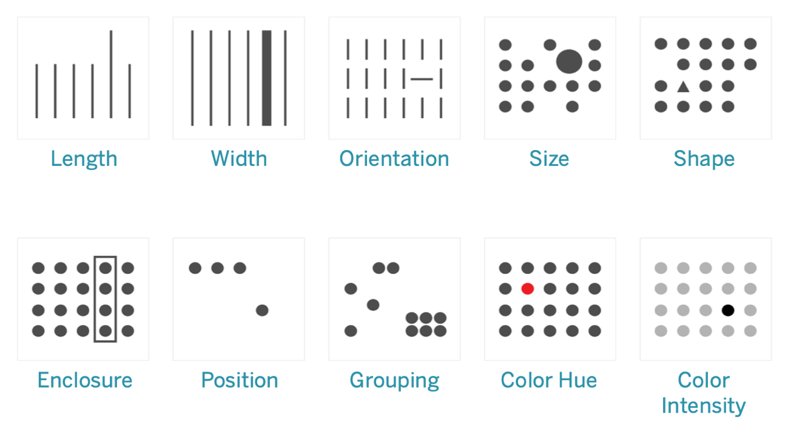
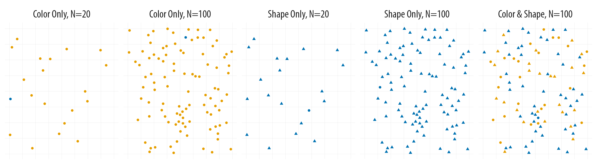

## Introductions 👋 {.center_title}

::: nonincremental
-   Name
-   Program
-   Why you decided to take this class
-   One thing you hope to learn
:::

# Course logistics 🗺️ {.center_title}

## Teaching Team {.center_title}

### Instructor: Jessica Cooperstone

✉️ [cooperstone.1\@osu.edu](cooperstone.1@osu.edu)\
\

### TA: Mia Scott<br>

✉️ [scott.2291\@osu.edu](scott.2291@osu.edu)\
\

### Office hours: [go.osu.edu/dataviz-times](https://go.osu.edu/dataviz-times)

## Website {.center_title}

If you have found these slides, you've made it to the website! (Good job.)\
\

### **All course materials will be posted to, or linked to from [www.rdataviz.com](https://www.rdataviz.com/)**

\

## Syllabus

-   A full version of the syllabus can be found on Carmen

-   A trimmed version of the syllabus can be found on our [course site](https://www.rdataviz.com/syllabus/syllabus.html) 

## Attendance {.center_title .smaller}

::: incremental
-   <p>Class will taught in a hybrid, synchronous manner, meaning I expect you to attend class during class time. This attendance can happen in person, or virtually via [Zoom](https://go.osu.edu/dataviz-zoom) I have found that students who attend in person are more engaged, and tend to master material more quickly. But, it is up to you how you want to attend.</p>

-   I will record class time for those who want to 1) revisit material or 2) can't attend (this should be uncommon). These recordings are not to replace coming to class.
:::

## How class will be?

-   A combination of lecture, code run-throughs, live coding, and hands-on exercises.

-   Bring a laptop (not tablet) to class with R and RStudio downloaded [(instructions)](https://osu-codeclub.github.io/pages/setup.html)

-   Come with your questions!

-   Engage as much as you can!

## How can you get help?

We are here to help you and will match the enthusiasm that you put into this course. We expect that you will run into issues for which you would like help. You can ask questions:

-   During class time (both lecture and recitation)
-   During office hours 
-   Before or after class
-   By email (least preferred) - be sure to provide relevant information so we can help you!


## Previous programming experience

You do not need to be an R expert for this class, but I will assume working-level knowledge of R programming. If you have no experience with R, but would still like to take this class, you can. I ask then you get yourself up to speed before the start of the 4th week of class by:

- taking this free online class [https://www.edx.org/course/data-science-r-basics](https://www.edx.org/course/data-science-r-basic) (audit only)
- going through this [R for beginners workshop](https://osu-codeclub.github.io/carpentries-aug-2026/)

## Assigments {.center_title .smaller}

-   **Module assignments:** After each module, there will be an assignment (4) to provide practice for the techniques learned in class.

-   **Class reflections:** After 10 of the 16 weeks, you will write a 1 paragraph reflection on the material that was presented in class. This can include your thoughts on how you will use these lessons in your own research and data visualizations, ways in which you have investigated this topic (or expect to) on your own, or what else you'd like to learn in this area. The purpose of this assignment is not to be burdensome, but to keep you engaged in the course material, and providing feedback to me on what parts you've found useful, what you've struggled with, and what you'd like to see more of in the future.

-   **Recitation submissions:** I ask you submit 8 of 11 recitations to Carmen to show you have made a good faith effort to engage with the course material. I will mark these at 0 or 1 points, with 1 point given for completion of at least 70% of the assignment.

-   **Capstone assignment:** At the end of the semester, you will complete a capstone assignment where you create a series of visualizations based on your research data, data coming from your lab, or other data that is publicly available. I expect this assignment to be completed in R Markdown, annotated, and knitted into an easy-to-read .html file. I also expect your code to be fully commented such that I can understand what you are doing with each step, and why.

## Late assignments {.smaller}

-   I expect you will turn assignments in on time. Late assignments are not accepted. If there are extenuating circumstances that prevent you from turning in an assignment on time, please connect with me as soon as possible after such a situation arises for discussion about a possible deadline extension.

## Academic integrity 🏫 {.center_title}

-   It is fine for you to work with your classmates/labmates/whoever, but I expect you to turn in your own independent assignments representing your work

-   All assignments are open book, googling/investigating is required!

## Use of generative AI 

- Generative AI is not allowable for use in your reflections or for other written material turned in as part of an assignment. Suspected unauthorized use of generative AI on assignments of any type will be reported to COAM.

- Generative AI is allowable for aiding with your coding. When it is used, the following should be disclosed:
1. What model was used
2. What the purpose of the use was
3. What prompts were provided
4. How you edited code to make it work for your purpose
5. All code provided should be fully commented

# 🗓 Schedule

This is our tentative class schedule:

## 🗓️ Schedule (part 1)

```{r schedule1, echo=FALSE, warning=FALSE}
library(readxl)
library(knitr)
library(tidyverse)
schedule <- read_excel("../../../files/schedule_modules.xlsx",
                       sheet = "Schedule_date_2026")

schedule_1 <- schedule |> 
  filter(Module == "1: Principles")

schedule_2 <- schedule |> 
  filter(Module == "2: Coding fundamentals")

schedule_3 <- schedule |> 
  filter(Module == "3: Data exploration")

schedule_4 <- schedule |> 
  filter(Module == "4: Putting it together")

capstone <- schedule |> 
  filter(Module == "Capstone prep")
```

```{r}
kable(schedule_1)
```

## 🗓️ Schedule (part 2)

```{r schedule2, echo = FALSE}
kable(schedule_2)
```

## 🗓️ Schedule (part 3)

```{r schedule3, echo = FALSE}
kable(schedule_3)
```

## 🗓️ Schedule (part 4) {.smaller}

*November 10* will be asynchronous (Election Day) <br>
*November 25* will be asynchronous (short week of Thanksgiving)

```{r schedule4, echo = FALSE}
kable(schedule_4)
```

## 🗓️ Capstone prep

```{r capstone, echo = FALSE}
kable(capstone)
```

# What is data visualization?

# Why do we visualize our data? 🗣️ {.center_title}

# {data-menu-title="With great power comes great responsibility"}

> "With great power comes great responsibility" <br>-- Voltaire or Spider-Man

# Principles and process of data visualization 📊 {.center_title}

## [Process of visual analysis](https://help.tableau.com/current/blueprint/en-us/bp_cycle_of_visual_analysis.htm)

```{r echo = FALSE, fig.alt="process of visual analysis, going from task, to get data, to select visual maping, view data, develop insight, act/share, with all parts interconnected and a person in the middle (source: https://help.tableau.com/current/blueprint/en-us/bp_cycle_of_visual_analysis.htm)"}
#| fig-align: center

```

# Perception and data visualization

## Pre-attentive attributes

```{r echo = FALSE, fig.alt="Example of Pre-attentive Attribute, including length, width, orientation, size, shape, enclosure, position, grouping, color hue, color, (source: help.tableau.com)"}
#| fig-align: center

```

<p>Figure from [Data Storytelling 101: The Magic of Pre-attentive Attributes by Iwa Sanjaya](https://medium.com/microsoft-power-bi/data-storytelling-101-the-magic-of-pre-attentive-attributes-522da9785f36)</p>

## Pick out the blue circle

```{r echo = FALSE, fig.alt="Searching for the blue circle becomes progressively harder. From https://socviz.co/01-look-at-data.html#perception-and-data-visualization"}
#| fig-align: center

```

<p>Figure from [Data Visualization, a Practical Introduction by Kieran Healy ](https://socviz.co/01-look-at-data.html#perception-and-data-visualization)</p>


## [Gestalt Principles](https://socviz.co/01-look-at-data.html#gestalt-rules)

We infer relationships from visual elements even when they are sparse.

- **Proximity**: Things that are spatially near to one another seem to be related.
- **Similarity**: Things that look alike seem to be related.
- **Connection**: Things that are visually tied to one another seem to be related.
- **Continuity**: Partially hidden objects are completed into familiar shapes.
- **Closure**: Incomplete shapes are perceived as complete.
- **Figure and Ground**: Visual elements are taken to be either in the foreground or the background.
- **Common Fate**: Elements sharing a direction of movement are perceived as a unit.

