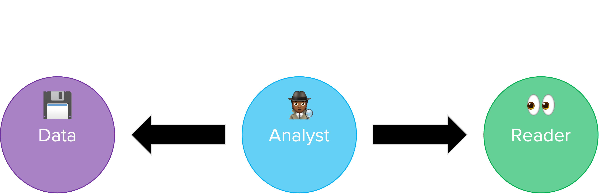
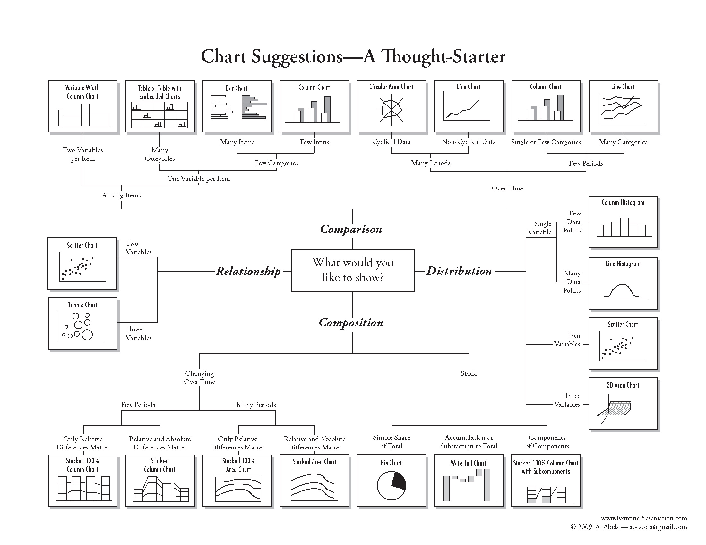
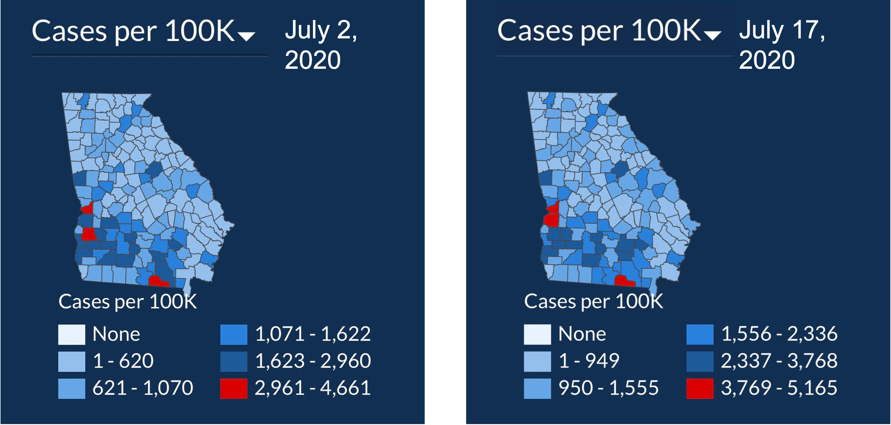
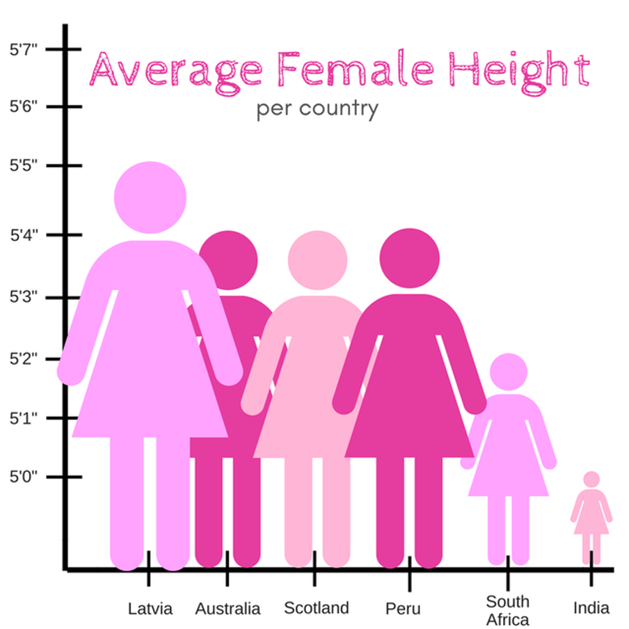
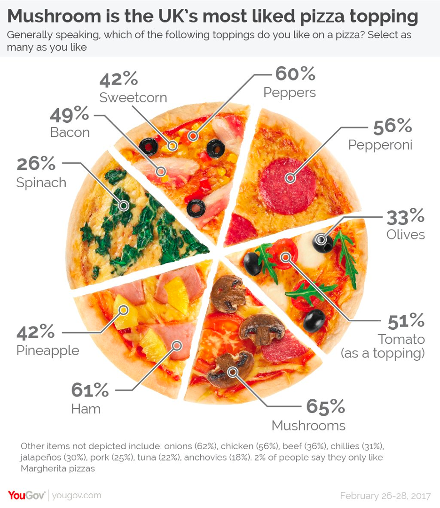
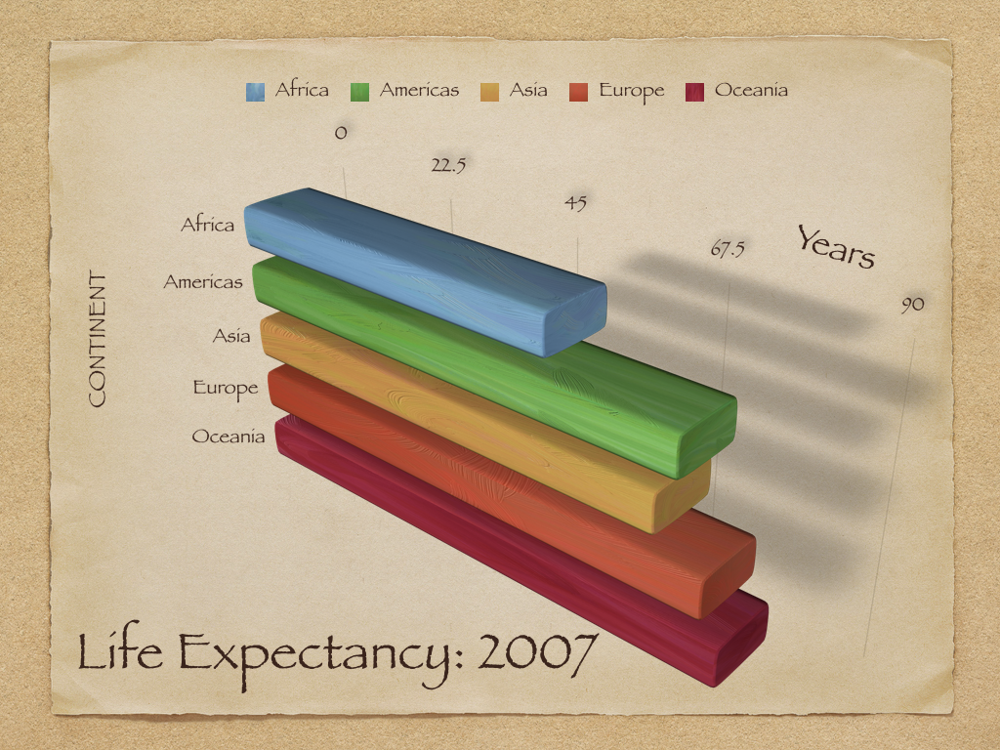

## Questions from last week?  {.center_title}

## The data visualization process {.center_title}

```{r echo = FALSE, fig.alt="A figure with three circles, and arrows between the first and second, and second and third. First circle says data, middle circle says analyst, and third right-most circle says learner. In between data and analyst= is explore, analyze and learn, and in between analyst and learner is explain, explore and persuade."}

```

<p>Figure adapted from one by [Rick Scavetta](https://twitter.com/rick_scavetta?lang=en)</p>

## There may be a data dinosaur 🦖 {background-color="#fff"}

```{r echo = FALSE, fig.alt="A gif of 13 different datasets (include one who's points make the shape of a dinosaur) that all have the same mean and standard deviation, but have very different distributions"}
knitr::include_graphics("img/dinosaurus.gif")
```

Figure by [Alberto Cairo](https://www.autodesk.com/research/publications/same-stats-different-graphs)

## What are we trying to visualize?

- Amounts
- Distributions
- Proportions
- Associations
- x-y relationships
- Geospatial data
- Uncertainty

## Chart types

```{r echo = FALSE, fig.alt="Chart suggestions, a thought starter. Shows how different plot types can be used if you want to compare across groups, show a relationship, understand a distribution, or undrestand compositional differences."}
#| fig-align: center

```

# Small changes can make a big difference (and some examples)

## Order axes by something meaningful {.center_title background-color="#fff"}

```{r echo = FALSE, message = FALSE, warning = FALSE}
library(gapminder)
library(tidyverse)
library(ggpubr)
```

```{r echo=FALSE}
#| column: page
#| layout-nrow: 1
#| fig-height: 5.5
#| fig-width: 5

gapminder %>%
  filter(continent == "Asia" & year == "2007") %>%
  ggplot(aes(x = lifeExp, y = country)) +
    geom_col() + theme_bw() + 
  theme(axis.text = element_text(size =12))

gapminder %>%
  filter(continent == "Asia" & year == "2007") %>%
  ggplot(aes(x = lifeExp, y = reorder(country, lifeExp))) +
    geom_col() + theme_bw() +
   theme(axis.text = element_text(size =12))
```

## Encoding data with easy-to-process visual clues

Length is easier to see than angles or areas.

```{r echo = FALSE}
data <- data.frame(
  group=LETTERS[1:5],
  value=c(14,15,17,19,20)
)
```

```{r}
#| column: page
#| layout-nrow: 1
#| fig-height: 4.5
#| fig-width: 5

data %>%
  ggplot(aes(x="", y=value, fill=group)) +
  geom_bar(stat="identity", width=1, color = "black") +
  coord_polar("y", start=0) +
  theme_void()


```

## Encoding data with easy-to-process visual clues

Length is easier to see than angles or areas.

```{r}
#| column: page
#| layout-nrow: 1
#| fig-height: 4.5
#| fig-width: 5

data %>%
  ggplot(aes(x="", y=value, fill=group)) +
  geom_bar(stat="identity", width=1, color = "black") +
  coord_polar("y", start=0) +
  theme_void()


data %>%
  ggplot(aes(x = group, y = value, fill=group)) +
  geom_col(color = "black") +
  theme_minimal() +
  theme(legend.position = "none")
```

## Color scales should be intuitive and accessible

```{r echo = FALSE, fig.alt="Figure with two maps of Georgia, depciting COVID cases per 100K people from July 2, 2020 and July 17, 2020. The color scale goes from white, to light blue, to dark blue, then to red, and the number of people in the different bins are not the same across plots. "}

```

. . .

These are not.

## Show your data if you can

#barbarplots

```{r}
#| column: page
#| layout-ncol: 3
#| fig-height: 4
#| fig-width: 3

gapminder %>%
  filter(year == 2007) %>%
  ggplot(aes(x = continent, y = lifeExp)) +
  stat_summary(geom = "bar") +
  theme_minimal() +
  labs(x = "Continent",
       y = "Life expectancy in 2017",
       title = "Life expectancy by continent",
       subtitle = "Data from the Gapminder project")

gapminder %>%
  filter(year == 2007) %>%
  ggplot(aes(x = continent, y = lifeExp)) +
  geom_boxplot() +
  theme_minimal() +
  labs(x = "Continent",
       y = "Life expectancy in 2017",
       title = "Life expectancy by continent",
       subtitle = "Data from the Gapminder project")

gapminder %>%
  filter(year == 2007) %>%
  ggplot(aes(x = continent, y = lifeExp)) +
  geom_boxplot(outlier.shape = NA) +
  geom_jitter(width = 0.3) +
  theme_minimal() +
  labs(x = "Continent",
       y = "Life expectancy in 2017",
       title = "Life expectancy by continent",
       subtitle = "Data from the Gapminder project")
```

## Know when to include zero

```{r echo = FALSE, fig.alt="Figure showing the average height of women (y-axis) from different countries (x-axis). But the y-axis only goes from 5 foot to 5 foot 7 inches, making women from India look tiny and women from Latvia seem enormous."}
#| fig-align: center

```

## Cut your axes with care

```{r}
#| column: page
#| layout-ncol: 2
#| fig-height: 4
#| fig-width: 4.5

gapminder %>%
  filter(year == 2007) %>%
  ggplot(aes(x = continent, y = lifeExp)) +
  stat_summary(geom = "bar") +
  theme_minimal() +
  labs(x = "Continent",
       y = "Life expectancy in 2017",
       title = "Life expectancy by continent",
       subtitle = "Data from the Gapminder project")

gapminder %>%
  filter(year == 2007) %>%
  ggplot(aes(x = continent, y = lifeExp)) +
  stat_summary(geom = "bar") +
  theme_minimal() +
  coord_cartesian(ylim = c(55, 82)) +
  labs(x = "Continent",
       y = "Life expectancy in 2017",
       title = "Life expectancy by continent",
       subtitle = "Data from the Gapminder project")
```

## Make it easy to compare 🍝

::: {.r-stack}

::: {.fragment .fade-out}
```{r}
library(tidyverse)
library(hrbrthemes)
library(kableExtra)
options(knitr.table.format = "html")
library(babynames)
library(viridis)
library(DT)
library(plotly)

# Load dataset from github
data <- babynames %>% 
  filter(name %in% c("Mary","Emma", "Ida", "Ashley", "Amanda", "Jessica",    
                     "Patricia", "Linda", "Deborah",   "Dorothy", "Betty", "Helen")) %>%
  filter(sex=="F")

# Plot
data %>%
  ggplot( aes(x=year, y=n, group=name, color=name)) +
    geom_line() +
    scale_color_viridis(discrete = TRUE) +
    theme(
      legend.position="none",
      plot.title = element_text(size=14)
    ) +
    labs(title = "A spaghetti chart of baby names popularity",
         color = "Name",
         y = "Number of babies",
         caption = "From https://www.data-to-viz.com/caveat/spaghetti.html") +
    theme_minimal()
```
:::

::: {.fragment}
```{r}
tmp <- data %>%
  mutate(name2=name)

tmp %>%
  ggplot( aes(x=year, y=n)) +
    geom_line( data=tmp %>% dplyr::select(-name), aes(group=name2), color="grey", size=0.5, alpha=0.5) +
    geom_line( aes(color=name), color="#69b3a2", size=1.2 )+
    scale_color_viridis(discrete = TRUE) +
    theme_minimal() +
    theme(
      legend.position="none",
      plot.title = element_text(size=14),
      panel.grid = element_blank()
    ) +
    labs(title = "A spaghetti chart of baby names popularity",
         caption = "From https://www.data-to-viz.com/caveat/spaghetti.html",
         y = "Number of babies") +
    facet_wrap(~name) 
```
:::
:::

## Think about the best color scale to use

```{r echo = FALSE, fig.alt="Figuring showing the difference between sequential, categorical, and diverging color scales. Figure by Lisa Charlotte Muth from https://www.datawrapper.de/blog/which-color-scale-to-use-in-data-vis"}
#| fig-align: center
knitr::include_graphics("img/200801_colorscale-intro-f-1.avif")
```

Figure by Lisa Charlotte Muth and from [datawrapper.de](https://www.datawrapper.de/blog/which-color-scale-to-use-in-data-vis)

## Make sure your plot has a clear message 🍕

```{r echo = FALSE, fig.alt="Figure showing the average height of women (y-axis) from different countries (x-axis). But the y-axis only goes from 5 foot to 5 foot 7 inches, making women from India look tiny and women from Latvia seem enormous."}
#| fig-align: center

```

## Simpler is better

No unnecessary words in a sentence, no unnecessary sentences in a paragraph. Keep only the parts of the plot that serve a purpose.

```{r echo = FALSE, fig.alt="A very ugly 3D plot showing life expectancy across the 5 continents where the 3D makes it hard to read, it has duplicative legends, and meaningless colors.", fig.cap="From https://socviz.co/lookatdata.html"}
#| fig-align: center

```

## Be consistent among figures

-   Use the same color schemes/shapes across figures

-   If you're ordering/grouping, do so in the same manner


## Oral presentation and publication figures might not be the same

# Some take home messages

## What should you think about when making visualizations?

1.  Who are you talking to? 📢

2.  What are you trying to convey? 📝

3.  How can you fairly represent your data? 🚯

## Next class - discussion of module 1 assignment

Submit (through Carmen) by Monday 9/7/2026 at 11:59pm:

* 1 good visualization (and a paragraph on why its good)
* 1 bad visualization (and a paragraph on why its bad)

::: {.fragment}
Be specific - talk about how aesthetics you see are linked to your understanding of the figure, and whether this is effective or not. 

We will go through these next week. Mia will pick her favorite good and the bad visualizations and there will be prizes! 🎉
:::
