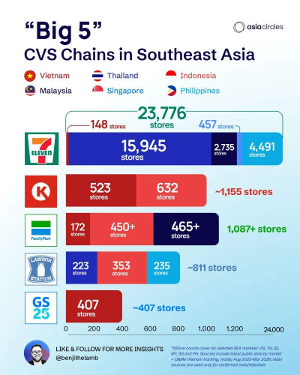
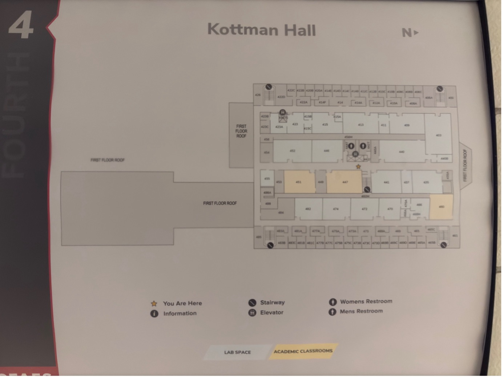
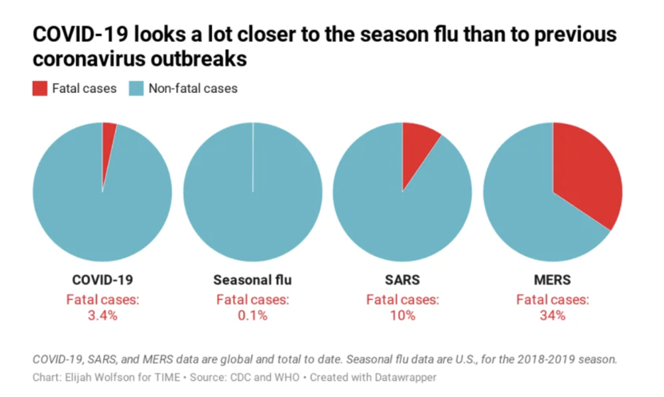
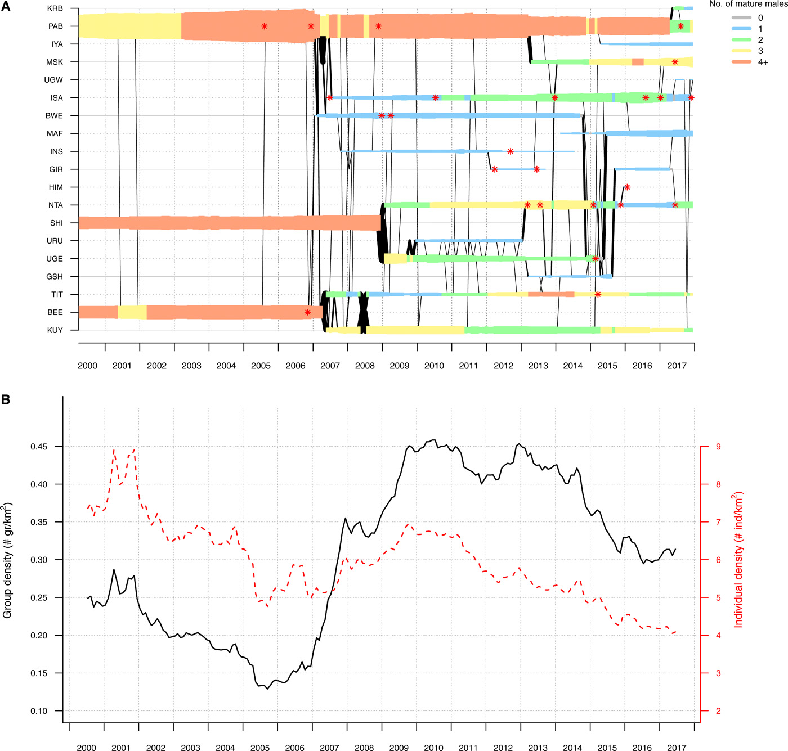
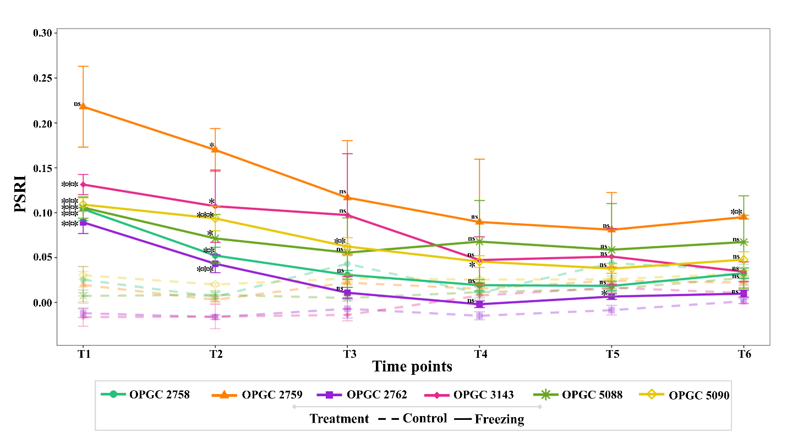
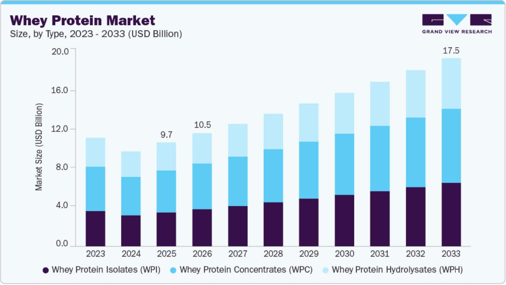
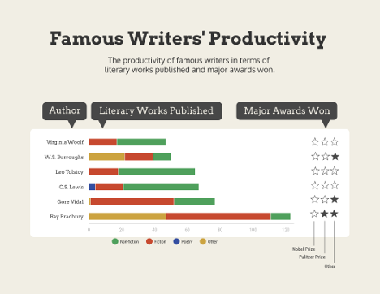
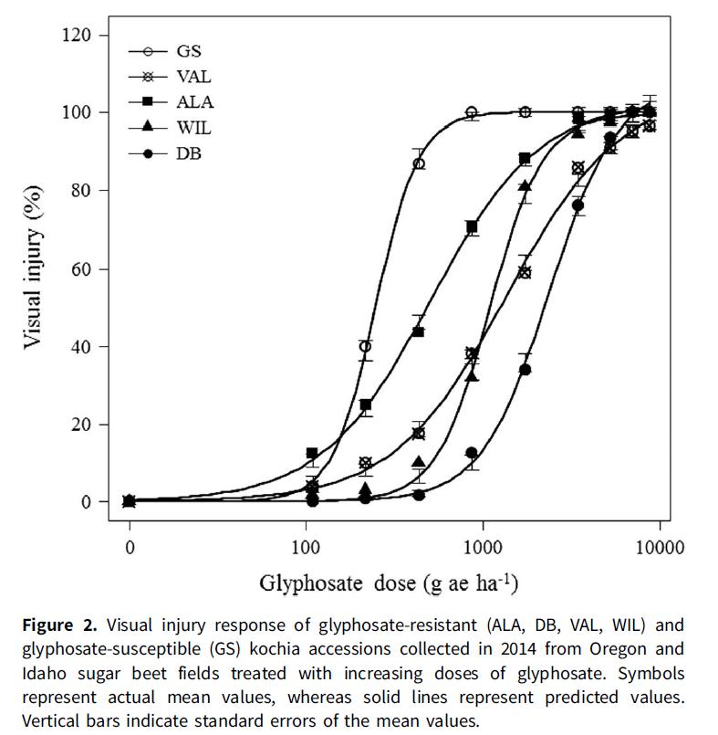
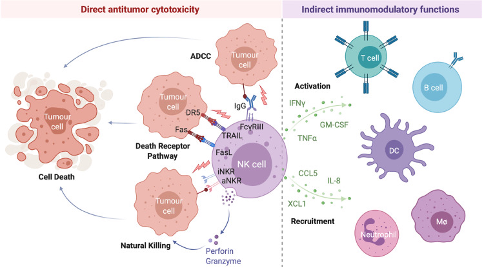
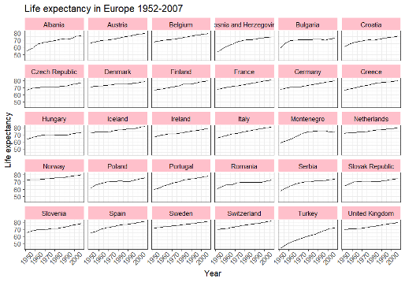

# Housekeeping

-   Questions from the previous class?
-   Take [edX R basics class](https://pll.harvard.edu/course/data-science-r-basics) if you don't have R experience. Can also go through content at an [R Basics Code Club workshop](https://osu-codeclub.github.io/carpentries-aug-2026/) from August 2026.
-   Start think about identifying a data-set for your capstone assignment
-   Don't forget about your reflections 🪞
-   Recitations start next week!

# Office hours

Mondays, 4-5pm, Pelotonia Research Center or via [Zoom](www.go.osu.edu/dataviz-zoom)

# How did you go about finding your visualizations?

## What was easier to find?

-   Good 👏 visualizations
-   Bad 😡 visualizations

# What are we doing today?

- Bad: why are they bad (specifically), how can they be made better?
- Good: why are they good (specifically), can we still improve them?

# Bad visualizations 😡 {.center_title}

## SE Asian Convenience Stores 🍙

Yongju

{fig-align="center"}

## Kottman at it again

Xucheng

{fig-align="center"}

## COVID from March 2020 🤧

Shanelle

{fig-align="center"}

## Mia's favorite worst 🦍

Haaniya 🏅

{fig-align="center"}

# Good visualizations 👏 {.center_title}

## Plant response to freezing 🌱🥶

{fig-align="center"}

## Whey cool 🥛

{fig-align="center"}

## Writer's productivity 📖

{fig-align="center"}

## Killing weeds 🌾

{fig-align="center"}

## Mia's favorite best 🦠

Amy 🏅

{fig-align="center"}

## Mia's favorite best 🦠

Karina 🏅

{fig-align="center"}

# Closing thoughts
