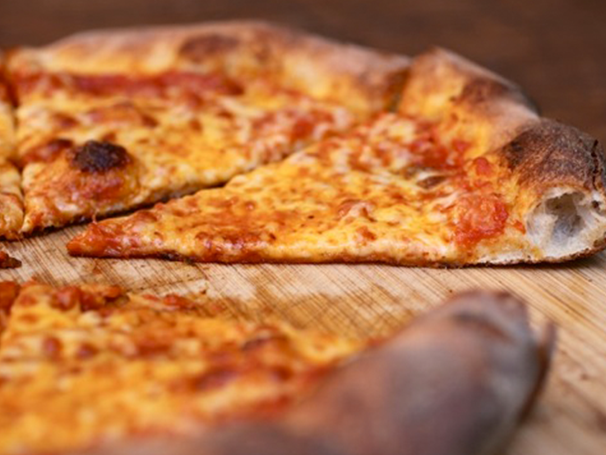

```{r setup, include=FALSE}
knitr::opts_chunk$set(echo = TRUE)
```

## Introduction

Today is the first recitation for [Module 4](_site/module4.html) where we put together a lot of the material we've learned in the first 3 modules of this course. Today's material is on conducting principal components analysis (PCA) using R, and visualizing the results with some tools we've already learned to use, and some new wrangling and viz tips along the way.

```{r, fig.alt = "A picture of NY style gooey pizza", fig.cap = "[Source](https://www.asenzya.com/blog/2020/03/23/new-york-style-pizza/)", out.width = "70%", fig.align = "center", echo = FALSE}

```

```{r libraries, message = FALSE, warning = FALSE}
library(tidyverse) # everything
library(readxl) # reading in excel sheets
library(factoextra) # easy PCA plotting
library(glue) # easy pasting
library(ggrepel) # repelling labels away from their points
library(patchwork) # for combining and arranging plots
```

#### Read in data

We will be using data about pizza, which includes data collected about the nutritional information of 300 different grocery store pizzas, from 10 brands.

```{r}
pizza <- read_csv(file = "https://raw.githubusercontent.com/f-imp/Principal-Component-Analysis-PCA-over-3-datasets/master/datasets/Pizza.csv")
```

> How different are each of the different brands of pizzas analyzed overall? 

## 1. Run a PCA

Let's take a look at this new dataset
```{r head}
knitr::kable(head(pizza))
```

```{r prcomp}
pizza_pca <- prcomp(pizza[,-c(1:2)],
                    center = TRUE,
                    scale = TRUE)
```

We can also look at the output of our PCA in a different way using the function `summary()`.
```{r summary pca}
summary(pizza_pca) 
```

We can convert this summary into something later usable by extraction the element `importance` from `summary(alkaloids_pca)` and converting it to a dataframe.

```{r extract importance}
importance <- summary(pizza_pca)$importance %>%
  as.data.frame()

knitr::kable(head(importance))
```

By looking at the summary we can see, for example, that the first two PCs explain `r round((importance[3,2])*100, 2)`% of variance.

## 2. Make a scree plot of the percent variance explained by each component

### Using `fviz_eig()`
We can do this quickly using [`fviz_eig()`](https://rpkgs.datanovia.com/factoextra/reference/eigenvalue.html).
```{r fviz_eig}
fviz_eig(pizza_pca)
```

### Manually
If you wanted to make a scree plot manually, you could by plotting using a wrangled version of the `importance` dataframe we made earlier.

```{r importance wrangling manual plot 1}
# pivot longer
importance_tidy <- importance %>%
  rownames_to_column(var = "measure") %>%
  pivot_longer(cols = PC1:PC7,
               names_to = "PC",
               values_to = "value")

# plot
importance_tidy %>%
  filter(measure == "Proportion of Variance") %>%
  ggplot(aes(x = PC, y  = value)) +
  geom_col(alpha = 0.1, color = "black") +
  scale_y_continuous(labels = scales::percent) +
  theme_minimal() +
  labs(x = "Principal component",
       y = "Percent variance explained",
       title = "Pizza scree plot")
```

## 3. Make a scores plot of samples, coloring each sample by its brand

### Using `fviz_pca_ind()`

We can also look at a scores plot using [`fviz_pca_ind()`](https://rpkgs.datanovia.com/factoextra/reference/fviz_pca.html) where ind means individuals. Here, each point is a sample.
```{r scores fviz_pca_ind}
fviz_pca_ind(pizza_pca)
```

#### Manually

We want to plot the scores, which are in provided in `pizza_pca$x`.

We can convert the list into a dataframe of scores values by using `as.data.frame()`. Then we can bind back our relevant metadata so they're all together. Note, to use `bind_cols()` both datasets need to be in the same order. In this case they are so we are good.
```{r scores wrangling}
# create a df of alkaloids_pca$x
scores_raw <- as.data.frame(pizza_pca$x)

# bind meta-data
scores <- bind_cols(pizza[,1], # first columns
                    scores_raw)
```


```{r scores plotting 2}
# create objects indicating percent variance explained by PC1 and PC2
PC1_percent <- round((importance[2,1])*100, # index 2nd row, 1st column, times 100
                     1) # round to 1 decimal
PC2_percent <- round((importance[2,2])*100, 1) 

# plot
(scores_plot <- scores %>%
  ggplot(aes(x = PC1, y = PC2, fill = brand)) +
  geom_hline(yintercept = 0, linetype = "dashed") +
  geom_vline(xintercept = 0, linetype = "dashed") +
  geom_point(shape = 21, color = "black") +
  scale_fill_brewer(palette = "Set3") +
  theme_minimal() +
  labs(x = glue("PC1: {PC1_percent}%"), 
       y = glue("PC2: {PC2_percent}%"), 
       title = "PCA Scores Plot of Pizza Proximate Analysis Across 10 Brands",
       fill = "Brand"))
```

## 4. Make a loadings plot of samples

### Using `fviz_pca_var()`

We can also look at a loadings plot using [`fviz_pca_var()`](https://rpkgs.datanovia.com/factoextra/reference/fviz_pca.html) where var means variables. Here, each point is a variable.
```{r loadings fviz_pca_var}
fviz_pca_var(pizza_pca)
```

### Manually

We can also make a more customized loadings plot manually using ggplot and using the dataframe `alkaloids_pca$rotation`.

```{r loadings wrangling}
# grab raw loadings, without any metadata
loadings_raw <- as.data.frame(pizza_pca$rotation)

# convert rownames to column
loadings <- loadings_raw %>%
  rownames_to_column(var = "analysis_type")

# create vector of labels as we want them to appear
analysis_type_labels <- c("Moisture",
                          "Protein",
                          "Fat",
                          "Ash",
                          "Sodium",
                          "Carbohydrates",
                          "Calories")
```

We can then plot with ggplot like normal.

```{r loadings}
library(emojifont)
pizza_emoji <- emoji(search_emoji('pizza'))

(loadings_plot <- loadings %>%
  ggplot(aes(x = PC1, y = PC2, label = analysis_type_labels)) +
  geom_hline(yintercept = 0, linetype = "dashed") +
  geom_vline(xintercept = 0, linetype = "dashed") +
  geom_point() +
  geom_label_repel() +
  scale_fill_brewer() +
  theme_minimal() +
  labs(x = glue("PC1: {PC1_percent}%"), 
       y = glue("PC2: {PC2_percent}%"), 
       title = "PCA Loadings Plot for Pizza"))
```

## 5. Create either a biplot, or a visualization that shows both your scores and loadings plot together.

```{r patchwork re-ranging and plot}
# setting the range of the plot
(scores_plot_ranged <- scores_plot +
  coord_cartesian(xlim = c(-3, 5.5), ylim = c(-3, 3.5)))

# what is the ratio of the space on each side of the axis for the scores plot?
(x_ratio <- 3/(3+5.5))
(y_ratio <- 3/(3+3.5))

# check the ending range for the loadings plot
# 0.7 units looks good for x
x_scalar <- 0.7
# 0.6 units looks good for y
y_scalar <- 0.6

# what should the low range value be so that both plots are equally scaled?

# making the loadings plot match this range
(loadings_plot_ranged <- loadings_plot +
  coord_cartesian(xlim = c(-0.3818, x_scalar), ylim = c(-0.5140, y_scalar)))
```
Plot
```{r patchwork reranged, fig.width = 10}
scores_plot_ranged + loadings_plot_ranged
```

## Biplot

### Using `fviz_pca()`.

You can make a biplot quickly with [`fviz_pca()`](https://rpkgs.datanovia.com/factoextra/reference/fviz_pca.html). Note, `fviz_pca_biplot()` and `fviz_pca()` are the same.
```{r fviz_pca}
fviz_pca(pizza_pca)
```

Instead of making this plot manually, let's go through how to alter the existing plot made with `fviz_pca()`. We can do this because `factoextra` creates ggplot objects. To start off, we need to be using a dataframe that includes our metadata.

```{r fviz_pca relabelled plot 2}
# save as a new df
pizza_pca_labelled <- pizza_pca

# assign alkaloid_labels to rownames
rownames(pizza_pca_labelled$rotation) <- analysis_type_labels

# plot
fviz_pca(pizza_pca_labelled, # pca object
         label = "var",
         repel = TRUE,
         geom.var = c("text", "point"),
         col.var = "black") +
  geom_point(aes(fill = pizza$brand), shape = 21) +
  scale_fill_brewer(palette = "Set3") +
  theme_minimal() +
  labs(x = glue("PC1: {PC1_percent}%"), 
       y = glue("PC2: {PC2_percent}%"), 
       title = "PCA Pizza Biplot",
       fill = "Brand")
```


